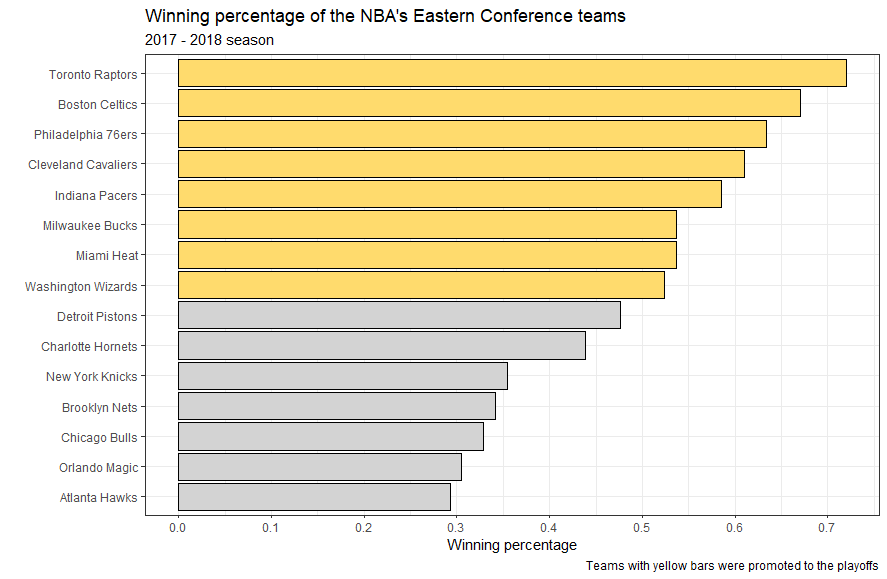
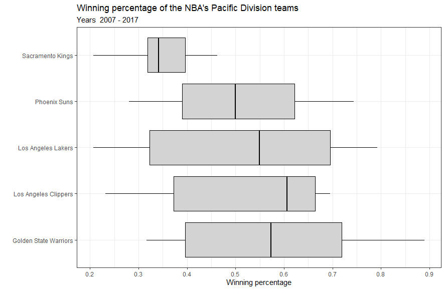

# nbawinper

The **nbawinper** package allows to automatically download data from [Basketball Reference](https://www.basketball-reference.com) about NBA teams winning percentage and create bar charts, boxplots and data frames with it.

## Installation

**remotes** package is required to install the **nbawinper** package.

``` r
#install.packages("remotes")
remotes::install_github("mateuszrydzik/nbawinper")
library(nbawinper)
```

## What is a winning percentage?

Winning percentage (or win-loss percentage) is a fraction of games a team has won. It is defined as wins divided by the total number of matches played. As some seasons do not end with the expected number of games played, the winning percentage is a more accurate indicator of team's progress, rather than amount of won games.

## Functions

-   [confplot - bar chart of a specific conference and year](#confplot)

-   [divplot - boxplot of a specific division and span of years](#divplot)

-   [confdf - data frame of a specific conference and year](#confdf)

## confplot

**`confplot`** creates a winning percentage bar chart for NBA teams in a chosen conference ('eastern' or 'western') and year (from 1971).

``` r
confplot(conference, year)
confplot('eastern', 2018)
```

## 

## divplot
**`divplot`** creates winning percentage boxplot for NBA teams in a chosen division and selected timespan (between 2005 and 2020). NBA consists of six divisions, three in Eastern Conference ('atlantic', 'central', 'southeast') and three in Western Conference ('northwest', 'pacific', 'southwest').

``` r
divplot(division, first.year, last.year)
divplot('pacific', 2007, 2017)
```




## confdf

**`confdf`** allows to create a data frame of NBA teams and their winning percentage, from a specific conference and year. You can use it if you want to create your own graphs, or if you want to work with winning percentage data.

``` r
confdf(conference, year)
df.west_2007 <- confdf('western', 2007)
df.east_1999 <- confdf('eastern', 1999)
```

## Support

This is my first ever written package, so I would appreciate any feedback, either through my email (matrydzik@gmail.com) or through GitHub.
